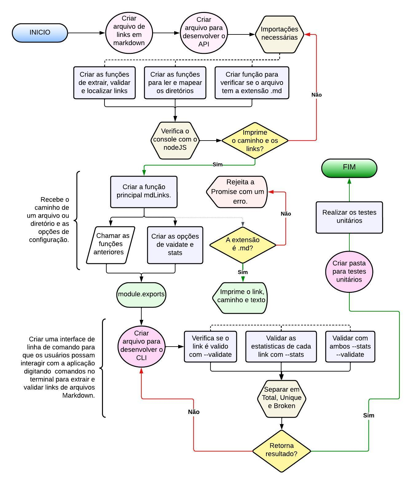

# Markdown Links

## Índice

* [1. Prefácio](#1-prefácio)
* [2. Guia de instalação e uso](#2-Guia-de-instalação-e-uso)
* [3. Fluxograma](#3-Fluxograma)
* [4. Tecnologias Utilizadas](#4-Tecnologias-Utilizadas)

***

# 1. Prefácio 👾
Markdown é uma linguagem de marcação amplamente utilizada por programadores em diversas plataformas, como GitHub, fóruns, blogs, entre outros. É comum encontrar arquivos com formato .md em praticamente todos os repositórios, especialmente no tradicional README.md.

O objetivo deste projeto é desenvolver uma biblioteca que permita a leitura de arquivos Markdown por meio de uma CLI (Interface de Linha de Comando), facilitando a execução da biblioteca diretamente no terminal, através de um módulo Node.js. Essa biblioteca terá a funcionalidade de ler arquivos com a extensão .md, verificar a existência de links e coletar estatísticas relacionadas a eles.

# 2. Guia de instalação e uso ✅

Para instalar a biblioteca, abra o terminal e digite o seguinte comando: npm install md-links-caroline-vaz

Após a instalação bem-sucedida, verifique se você possui um arquivo com a extensão .md contendo links dentro dele.
---
**1. Opção para obter os caminhos, textos e links do arquivo selecionado 📂**

Para visualizar os caminhos, textos e links do arquivo, execute o comando:

***Comando:***

***Exemplo:***

.png)
---
**2. Opção para validar os links do arquivo 📂**

Para validar os links do arquivo com requisições HTTP, utilize a propriedade --validate.

***Comando:***

***Exemplo:***

.png)
---
**3. Opção para verificar as estatísticas dos links do arquivo 📂**

Para verificar as estatísticas dos links do arquivo, utilize a propriedade --stats.

***Comando:***

***Exemplo:***

.png)
---
**4. Opção para verificar estatísticas e validar os links do arquivo 📂**

Para obter estatísticas e validar os links do arquivo, utilize a propriedade --validate --stats.

***Comando:***

***Exemplo:***

.png)
---
# 3. Fluxograma 📈

Fluxograma realizado para o projeto:

# 4. Tecnologias Utilizadas 💻

